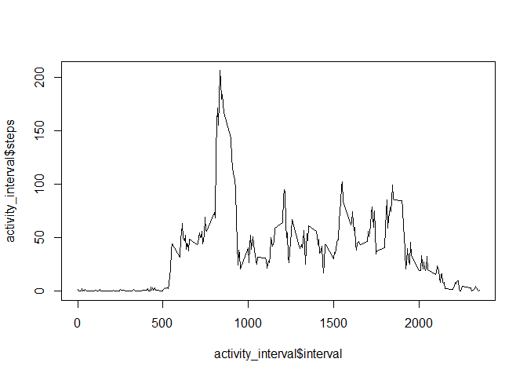

## Loading and preprocessing the data

Code used to download the data and read it into R.


```r
# Download and unzip file
download.file("https://d396qusza40orc.cloudfront.net/repdata%2Fdata%2Factivity.zip", destfile="activitydata.zip")
unzip("activitydata.zip")

# Read in data set
activity <- read.csv("activity.csv")
```

## What is the mean total number of steps taken per day?

Histogram of number of steps taken per day shows the most common total is 10,000 to 15,000 number of steps per day:


```r
activity_steps <- aggregate(steps~date, activity, sum)
hist(activity_steps$steps)
```

<!-- -->


```r
steps_mean <- mean(activity_steps$steps)
steps_median <- median(activity_steps$steps)
```

The mean steps is 10766 steps per day and the median is 10765 steps per day.


## What is the average daily activity pattern?

```r
activity_interval <- aggregate(steps~interval, activity, mean)
plot(activity_interval$interval, activity_interval$steps, type="l")
```

<!-- -->

```r
interval_max <- activity_interval[which.max(activity_interval$steps),]
```
On average, the maximum number of steps (206 steps) occurs at interval 835.


## Imputing missing values

```r
na_values <- sum(is.na(activity$steps))
```
There are 'r na_values' NA values out of 17,568 total values.

Imputing missing values by using the mean value of that interval across all days:

```r
# Replace NA values with the mean value associated with that interval
for (i in 1:length(activity[,1])) {
  interval <- activity[i,3]
  if (is.na(activity[i,1])) {
    activity[i,1] <- activity_interval[activity_interval$interval==interval,2]
  }
}

# The for loop used earlier overwrites the activity variable. Create new imputed_activity variable using the overwrited activity variable and then re-read the activity variable so there are two separate tables: one with imputed values and one without.
imputed_activity <- activity
activity <- read.csv("activity.csv")
```

Creating a histogram using the table with imputed values:


```r
imputed_activity_steps <- aggregate(steps~date, imputed_activity, sum)
hist(imputed_activity_steps$steps)
```

<!-- -->


```r
imputed_steps_mean <- mean(imputed_activity_steps$steps)
imputed_steps_median <- median(imputed_activity_steps$steps)
```

For the imputed data table, the mean steps is 10766 steps per day and the median is 10766 steps per day.
While the histogram for the imputed data is different, the mean and median values are the same. The histogram for the imputed data shows many more observations of 10,000 to 15,000 steps per day.

## Are there differences in activity patterns between weekdays and weekends?

Create factor variable for weekdays/weekends:

```r
library(dplyr)
```

```
## 
## Attaching package: 'dplyr'
```

```
## The following objects are masked from 'package:stats':
## 
##     filter, lag
```

```
## The following objects are masked from 'package:base':
## 
##     intersect, setdiff, setequal, union
```

```r
# Add "Day" column that gives the day of the week based on the date
imputed_activity <- imputed_activity %>% mutate(Day = weekdays(as.Date(imputed_activity$date)))
# If the value of "Day" column is Saturday or Sunday then label as Weekend in "Weekday.Weekend" column, else label as Weekday
imputed_activity$Weekday.Weekend <- ifelse(imputed_activity$Day %in% c("Saturday", "Sunday"), "Weekend", "Weekday")
```

Plot weekday and weekend activity patterns:

```r
agg_by_day <- aggregate(steps~interval+Weekday.Weekend, imputed_activity, mean)
library(ggplot2)
```

```
## Warning: package 'ggplot2' was built under R version 4.0.4
```

```r
ggplot(imputed_activity, aes(interval, steps)) + geom_line() + facet_grid(~ Weekday.Weekend)
```

<!-- -->
